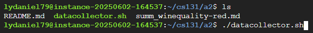
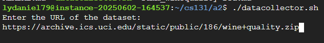
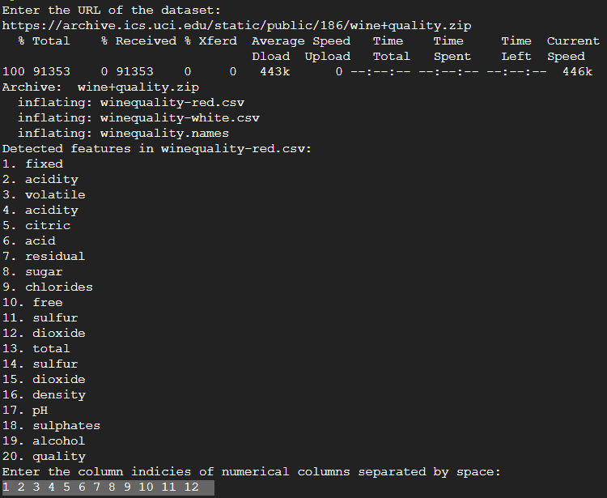

# CSV Feature Summary Tool

## What this command does

This shell script takes a URL pointing to a `.csv` file or a `.zip` file containing CSVs, downloads it, and generate a summary report for each CSV file. The summary includes a list of features (columns) and descriptive statistics (min, max, mean, standard deviation) for specified numerical columns

The script is designed to help quickly inspect and document the structure of tabular datasets.

---

## How to use this command
1. Ensure that you have the unzip command installed

```bash
sudo apt-get install unzip
```

2. Place the script in your working directory.
2. Make it executable:

```bash
chmod 700 datacollector.sh
```

# Demo

## running the command


## enter the url


## enter the column indices


##
The script has created a folder 'data' containing the zip, the csv files, and the md summary files
This is done so that if you want to delete anything relating, a simple
```bash
rm data -r
```
command can be used to swiftly delete the data

The data appears as such:


